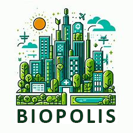
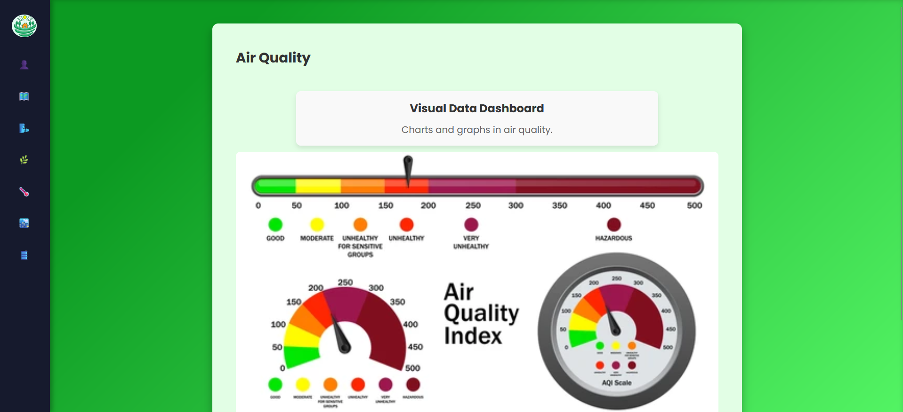
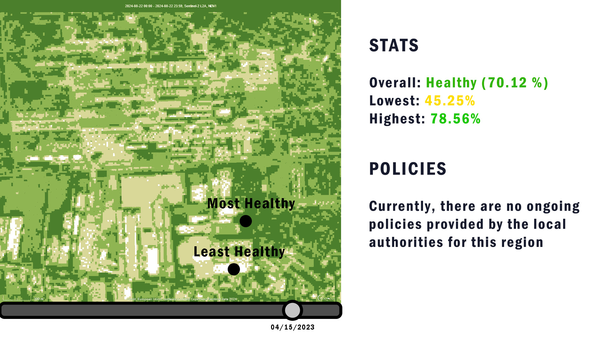
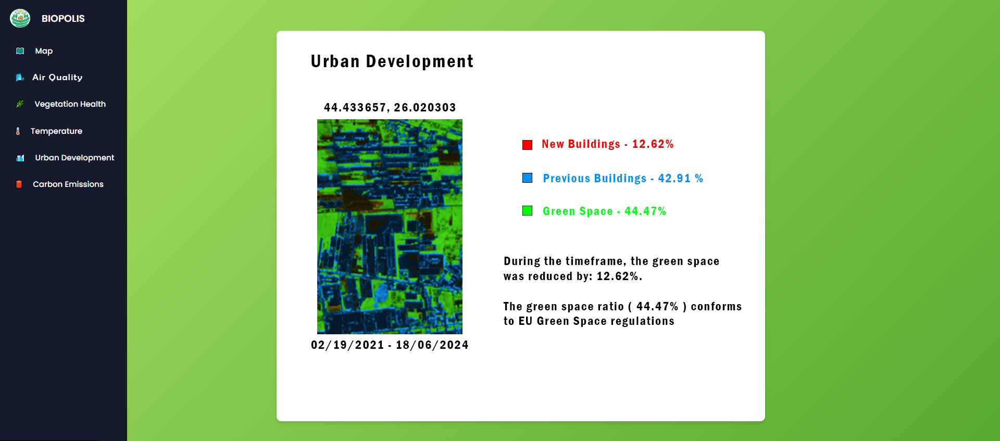

# Biopolis [ Proof of Concept ]

## Description

This project is a submission to the Cassini Hackathon 2024 edition.

Currently, every person heard at least once about the global warming or air pollution through different communication channels such as TV, social media or internet, or maybe it seems like there are too much apartment buildings next to each other, but no trees to be seen around.

For most people, that is just a vague idea to be considered once in a while, but what if we could easily get informed in real time about the current status of our local environment?

The data is already available, but Biopolis aims to aggregate it from different sources and satellite imagery, which is hard to understand as a person who's not familiar with the field, transforming it into intuitive, visual information.

## Features

We've downloaded Sentinel 2 pictures from Military Residence, a developing area in Bucharest, to showcase what our application would have to offer.

### Policies

Local authorities could have an easy to access channel through which to warn citizens of local hazards and provide safety instructions.

### Air Quality

The app could provide different statistics about Air Quality, using the Absorbing Aerosol Index, to detect traces of dust, smoke and ash in the air, which are linked to lung-related health issues.

### Vegetation Health

Heavy heat seasons and drought can be damaging to the vegetation. People could monitorize the vegetation health in their place of residence, with intuitive labels such as Unhealthy, Moderate Health, or Healthy and areas pictured on the map.

### Urban Development and Green Space Conformity

One of the key features of Biopolis is the ability to check whether there is enough vegetation inside an area or not, and whether the latest real estate development respects the current regulations on green space. 
This transparency we believe would spread awareness to the population and help combat urban growth malitious to the local environment.

### Carbon Emissions

Among the major concerns of urbanization and dense metropolitan areas, is the heavy emissions of carbon dioxide resulting from burning of fossil fuel for electricity, heat and transport.

There are ongoing initiatives to reduce greenhouse gases in an effort to prevent climate change.

Biopolis could provide a historic of carbon emissions in the area, and let citizens see the evolution of this problem. 

## Team

Andreea Bahan - High School Student - Frontend Developer

Iuliana Amaritei - High School Student - Frontend Developer

Clima Tudor - College Student - Backend Developer

Chiuta Mihai Marcel - College Student - Backend Developer / Designer / Team Lead

Orsan Emanuel Tarsiciu - College Student - Back End Developer
